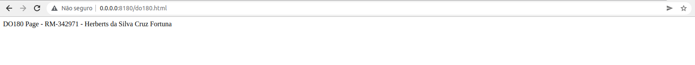
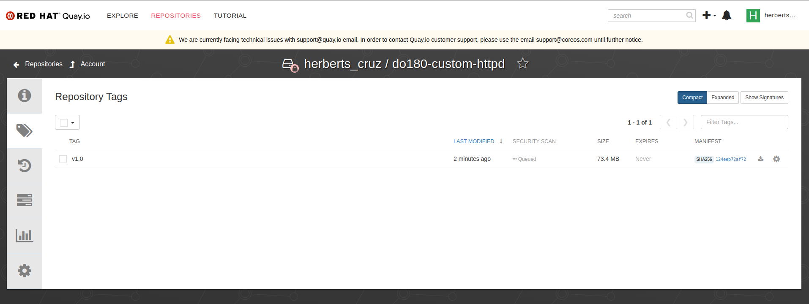
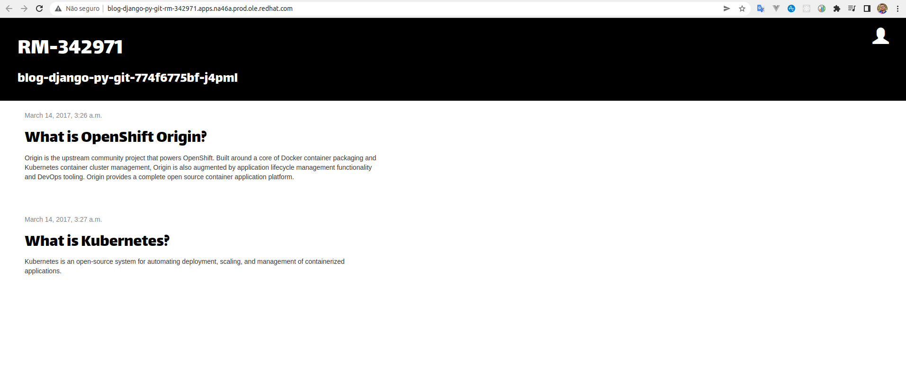
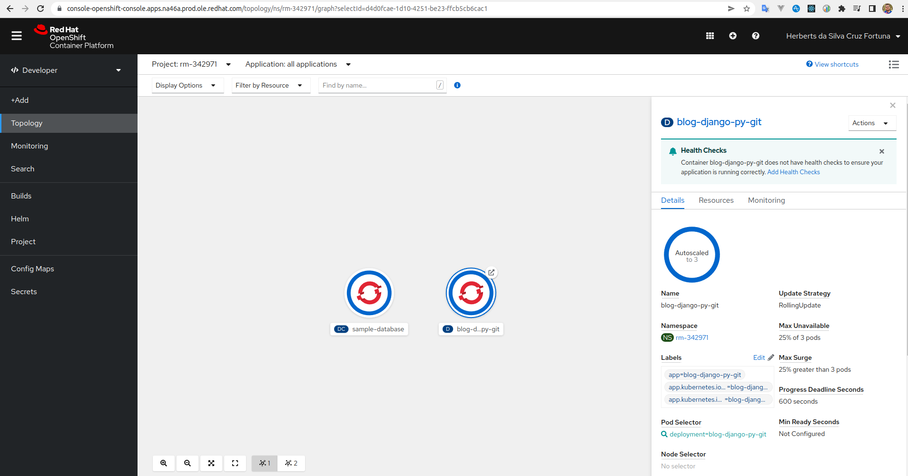
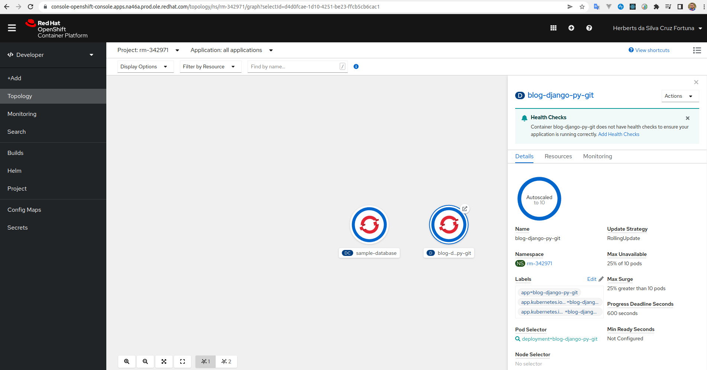
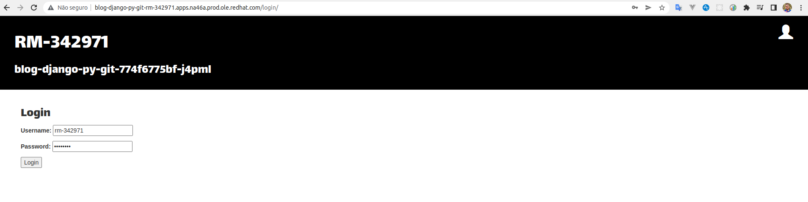
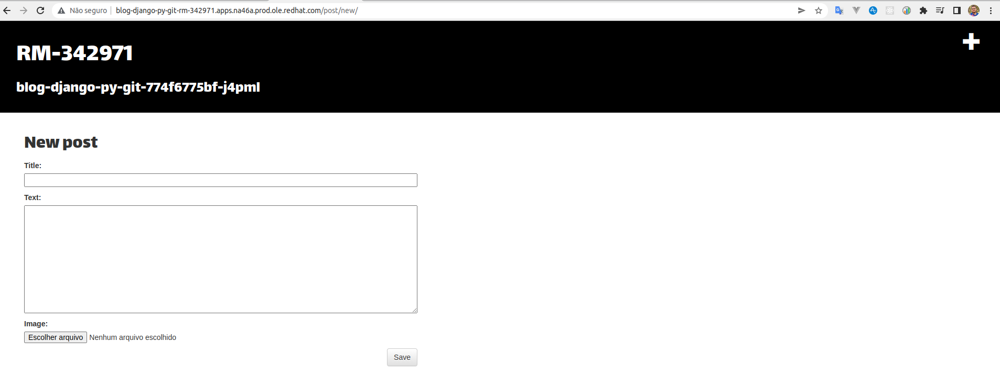
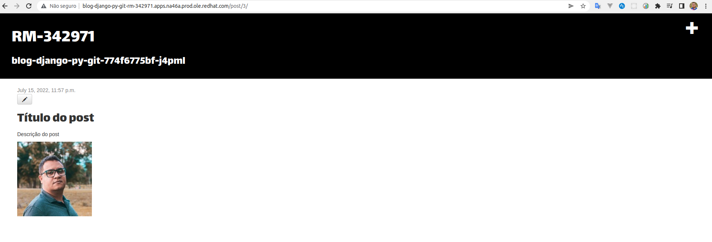

# Etapa 4 - Solution Sprint

- **Chave:** RM-342971
- **Nome:** Herberts da Silva Cruz Fortuna
- **Turma:** MBA 8ASO
- **Fase:** 4 - Containerization Strategy - De 11/05 até 12/07

## Dependências

- [Git](https://linuxhint.com/install-git-linux-mint/)

## Outras etapas

- [Etapa 1](./etapa1/README.md)

- [Etapas 2 e 3](./etapas2-3/README.md)

